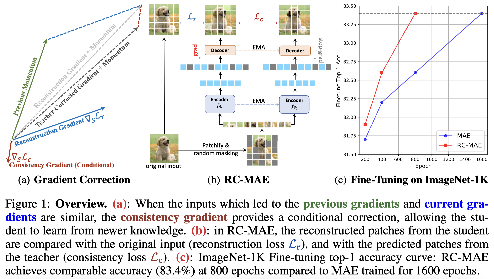

# Reconstruction-Consistent MAE (RC-MAE)

This repository inlcudes official implementations and model weights for [RC-MAE](https://openreview.net/forum?id=7sn6Vxp92xV).

[[`Arxiv`](https://arxiv.org/abs/2210.02077)] [[`OpenReview`](https://openreview.net/forum?id=7sn6Vxp92xV)] [[`BibTeX`](#CitingRC-MAE)]
 
> **[Exploring The Role of Mean Teachers in Self-supervised Masked Auto-Encoders](https://openreview.net/forum?id=7sn6Vxp92xV)**<br>
> 🏛️🏫[Youngwan Lee*](https://github.com/youngwanLEE), :school:[Jeff Willette*](https://jeffwillette.github.io/),️️ 🏛️Jonghee Kim, 🏫[Juho Lee](https://juho-lee.github.io/), :school:[Sung Ju Hwang](http://www.sungjuhwang.com/) <br>
> ETRI🏛️, KAIST🏫 <br>
> *: equal contribution <br>
> Internation Conference on Learning Representation (ICLR) 2023


## Abstract

Masked image modeling (MIM) has become a popular strategy for self-supervised learning (SSL) of visual representations with Vision Transformers. A representative MIM model, the masked auto-encoder (MAE), randomly masks a subset of image patches and reconstructs the masked patches given the unmasked patches. Concurrently, many recent works in self-supervised learning utilize the student/teacher paradigm which provides the student with an additional target based on the output of a teacher composed of an exponential moving average (EMA) of previous students. Although common, relatively little is known about the dynamics of the interaction between the student and teacher. Through analysis on a simple linear model, we find that the teacher conditionally removes previous gradient directions based on feature similarities which effectively acts as a conditional momentum regularizer. From this analysis, we present a simple SSL method, the Reconstruction-Consistent Masked Auto-Encoder (RC-MAE) by adding an EMA teacher to MAE. We find that RC-MAE converges faster and requires less memory usage than state-of-the-art self-distillation methods during pre-training, which may provide a way to enhance the practicality of prohibitively expensive self-supervised learning of Vision Transformer models. Additionally, we show that RC-MAE achieves more robustness and better performance compared to MAE on downstream tasks such as ImageNet-1K classification, object detection, and instance segmentation.




## Finetuning Results on ImageNet-1K
We train all models on **one** node equipped with **8 GPUs**.  

|       | MAE (repro.) | **RC-MAE (ours)** | Checkpoint |
|-------|--------------|-------------------|------------|
| ViT-S | 81.8         | 82.0              | [PT](https://dl.dropbox.com/s/w8udo7egbp6xjo1/rc_mae_vit_small_pt_1600ep.pth) \| [FN](https://dl.dropbox.com/s/bkjwoehfhkd0dd2/rc_mae_vit_small_fn.pth) |
| ViT-B | 83.4         | 83.6              | [PT](https://dl.dropbox.com/s/9ubjhgnutjtoexf/rc_mae_vit_base_pt_1600ep.pth) \| [FN](https://dl.dropbox.com/s/6nyplpabyum07mk/rc_mae_vit_base_fn.pth) |
| ViT-L | 85.5         | 86.1              | [PT](https://dl.dropbox.com/s/20fxvm5foy10m8t/rc_mae_vit_large_pt_1600ep.pth) \| [FN](https:/dl.dropbox.com/s/68wbpapvzwrmq5d/rc_mae_vit_large_fn.pth) |


## Instance segmentation Results on COCO
We train all models on **one** node equipped with **8 GPUs**.  
We implemented based on an [mimdet](https://github.com/hustvl/MIMDet) which reproduced [Benchmarking Detection Transfer Learning with Vision Transformers](https://arxiv.org/abs/2111.11429). 


| Method     | Backbone | box AP | mask AP | Checkpoint |
|------------|----------|--------|---------|------------|
| MAE        | ViT-B    | 50.3   | 44.9    | -          |
| **RC-MAE** | ViT-B    | 51.0   | 45.4    | [link](https://dl.dropbox.com/s/9qsk8t5dcxxhql9/rc_mae_vit_base_mask_rcnn.pth)       |
| MAE        | ViT-L    | 53.3   | 47.2    | -          |
| **RC-MAE** | ViT-L    | 53.8   | 47.7    | [link](https://dl.dropbox.com/s/cv1zznwebgcn78c/rc_mae_vit_large_mask_rcnn.pth)       |


## Requirements
We used `pytorch==1.7.0` `timm==0.3.2`.  
We implemented on top of the official [mae](https://github.com/facebookresearch/mae) code.


## Pre-training RC-MAE

We provide [scripts](https://github.com/youngwanLEE/rc-mae-release/tree/main/scripts) for pretraining, finetuning, and linear probing.

To pre-train ViT-Base (recommended default) with **multi-GPU setting**, run the following on 1 node with 8 GPUs:

```bash
bash ./scripts/pretrain_rc_mae_vit_base_1600ep.sh ${DATA} ${OUTPUT_DIR}
```
`${DATA}`: ImageNet data path  
`${OUTPUT_DIR}`: ouptut folder name 

## Finetuning & Linear probing

```bash
bash ./scripts/finetune_rc_mae_base.sh ${DATA} ${CKPT_FILE_PATH} ${OUTPUT_DIR}
```
`${DATA}`: ImageNet data path  
`${CKPT_FILE_PATH}`: pre-trained checkpoint file path  
`${OUTPUT_DIR}`: ouptut folder name  


## Acknowledgement

This repository is built using the [MAE](https://github.com/facebookresearch/mae), [Timm](https://github.com/rwightman/pytorch-image-models)
library, and [DeiT](https://github.com/facebookresearch/deit) repositories.

This work was partly supported by Institute of Information \& Communications Technology Planning \& Evaluation(IITP) grant funded by the Korea government(MSIT) (No. 2014-3-00123, Development of High Performance Visual BigData Discovery Platform for Large-Scale Realtime Data Analysis, No. 2020-0-00004, Development of Previsional Intelligence based on Long-term Visual Memory Network), (No.2022-0-00124, Development of Artificial Intelligence Technology for Self-Improving Competency-Aware Learning Capabilities), (No. RS-2022-00187238, Development of Large Korean Language Model Technology for Efficient Pre-training), and (No.2019-0-00075, Artificial Intelligence Graduate School Program(KAIST)).

## License

This project is under CC-BY-NC 4.0 license. Please see [LICENSE](LICENSE) for details.

## <a name="CitingRC-MAE"></a>CitingRC-MAE

```BibTeX
@inproceedings{
    lee2023rcmae,
    title={Exploring The Role of Mean Teachers in Self-supervised Masked Auto-Encoders},
    author={Youngwan Lee and Jeffrey Ryan Willette and Jonghee Kim and Juho Lee and Sung Ju Hwang},
    booktitle={International Conference on Learning Representations},
    year={2023},
    url={https://openreview.net/forum?id=7sn6Vxp92xV}
}
```
